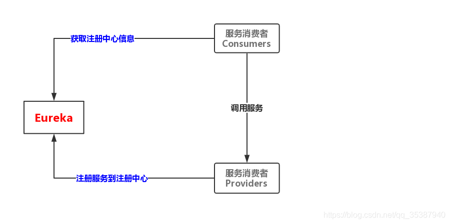

# Spring Cloud + Eureka + zipkin 模块学习

>### Spring Cloud整合Eureka

用一张图简单说明下Eureka：



+ Eureka注册中心

    pom.xml

    ```xml
    <?xml version="1.0" encoding="UTF-8"?>
    <project xmlns="http://maven.apache.org/POM/4.0.0" xmlns:xsi="http://www.w3.org/2001/XMLSchema-instance"
             xsi:schemaLocation="http://maven.apache.org/POM/4.0.0 https://maven.apache.org/xsd/maven-4.0.0.xsd">
        <modelVersion>4.0.0</modelVersion>
        <parent>
            <groupId>org.springframework.boot</groupId>
            <artifactId>spring-boot-starter-parent</artifactId>
            <version>2.3.5.RELEASE</version>
            <relativePath/> <!-- lookup parent from repository -->
        </parent>
        <groupId>com.example</groupId>
        <artifactId>zipkin-server</artifactId>
        <version>0.0.1-SNAPSHOT</version>
        <name>zipkin-server</name>
        <description>Demo project for Spring Boot</description>
    
        <properties>
            <java.version>11</java.version>
            <spring-cloud.version>Hoxton.SR8</spring-cloud.version>
        </properties>
    
        <dependencies>
            <dependency>
                <groupId>org.springframework.boot</groupId>
                <artifactId>spring-boot-starter-web</artifactId>
            </dependency>
            <dependency>
                <groupId>org.springframework.cloud</groupId>
                <artifactId>spring-cloud-starter-netflix-eureka-server</artifactId>
            </dependency>
    
            <dependency>
                <groupId>org.springframework.boot</groupId>
                <artifactId>spring-boot-starter-test</artifactId>
                <scope>test</scope>
                <exclusions>
                    <exclusion>
                        <groupId>org.junit.vintage</groupId>
                        <artifactId>junit-vintage-engine</artifactId>
                    </exclusion>
                </exclusions>
            </dependency>
        </dependencies>
    
        <dependencyManagement>
            <dependencies>
                <dependency>
                    <groupId>org.springframework.cloud</groupId>
                    <artifactId>spring-cloud-dependencies</artifactId>
                    <version>${spring-cloud.version}</version>
                    <type>pom</type>
                    <scope>import</scope>
                </dependency>
            </dependencies>
        </dependencyManagement>
    
        <build>
            <plugins>
                <plugin>
                    <groupId>org.springframework.boot</groupId>
                    <artifactId>spring-boot-maven-plugin</artifactId>
                </plugin>
            </plugins>
        </build>
    
    </project>
    ```

    ZipkinServerApplication.java
    
    ```java
    import org.springframework.boot.SpringApplication;
    import org.springframework.boot.autoconfigure.SpringBootApplication;
    import org.springframework.cloud.netflix.eureka.server.EnableEurekaServer;
    
    @SpringBootApplication
    @EnableEurekaServer
    public class ZipkinServerApplication {
    
        public static void main(String[] args) {
            SpringApplication.run(ZipkinServerApplication.class, args);
        }
    
    }
    ```
  
    application.yml
    
    ```yml
    server:
      port: 3000
    spring:
      application:
        name: kite-eureka-center
    eureka:
      instance:
        hostname: eureka-center # 主机名
        appname: eureka-server # 获取要在eureka注册的应用程序的名称
      client:
        registerWithEureka: false # 单点的时候设置为 false 禁止注册自身
        fetchRegistry: false # 是否从eureka服务器获取注册信息
        serviceUrl:
          defaultZone: http://localhost:3000/eureka # 设置eureka服务器所在的地址，查询服务和注册服务都需要依赖这个地址
      server:
        enableSelfPreservation: false # 是否开启注册中心自我保护机制
        evictionIntervalTimerInMs: 4000 # 注册中心清理间隔（单位毫秒）
    ```

+ 服务提供者 + zipkin

    pom.xml
    
    ```xml
    <?xml version="1.0" encoding="UTF-8"?>
    <project xmlns="http://maven.apache.org/POM/4.0.0" xmlns:xsi="http://www.w3.org/2001/XMLSchema-instance"
             xsi:schemaLocation="http://maven.apache.org/POM/4.0.0 https://maven.apache.org/xsd/maven-4.0.0.xsd">
        <modelVersion>4.0.0</modelVersion>
        <parent>
            <groupId>org.springframework.boot</groupId>
            <artifactId>spring-boot-starter-parent</artifactId>
            <version>2.3.5.RELEASE</version>
            <relativePath/> <!-- lookup parent from repository -->
        </parent>
        <groupId>com.example</groupId>
        <artifactId>provider</artifactId>
        <version>0.0.1-SNAPSHOT</version>
        <name>provider</name>
        <description>Demo project for Spring Boot</description>
    
        <properties>
            <java.version>11</java.version>
            <spring-cloud.version>Hoxton.SR9</spring-cloud.version>
        </properties>
    
        <dependencies>
            <dependency>
                <groupId>org.springframework.boot</groupId>
                <artifactId>spring-boot-starter-web</artifactId>
            </dependency>
            <dependency>
                <groupId>org.springframework.cloud</groupId>
                <artifactId>spring-cloud-starter-netflix-eureka-client</artifactId>
            </dependency>
            <dependency>
                <groupId>org.projectlombok</groupId>
                <artifactId>lombok</artifactId>
            </dependency>
            <dependency>
                <groupId>org.springframework.cloud</groupId>
                <artifactId>spring-cloud-starter-zipkin</artifactId>
            </dependency>
    
            <dependency>
                <groupId>org.springframework.boot</groupId>
                <artifactId>spring-boot-starter-test</artifactId>
                <scope>test</scope>
                <exclusions>
                    <exclusion>
                        <groupId>org.junit.vintage</groupId>
                        <artifactId>junit-vintage-engine</artifactId>
                    </exclusion>
                </exclusions>
            </dependency>
        </dependencies>
    
        <dependencyManagement>
            <dependencies>
                <dependency>
                    <groupId>org.springframework.cloud</groupId>
                    <artifactId>spring-cloud-dependencies</artifactId>
                    <version>${spring-cloud.version}</version>
                    <type>pom</type>
                    <scope>import</scope>
                </dependency>
            </dependencies>
        </dependencyManagement>
    
        <build>
            <plugins>
                <plugin>
                    <groupId>org.springframework.boot</groupId>
                    <artifactId>spring-boot-maven-plugin</artifactId>
                </plugin>
            </plugins>
        </build>
    
    </project>
    ```

    ProviderApplication.java
    
    ```java
    import org.springframework.boot.SpringApplication;
    import org.springframework.boot.autoconfigure.SpringBootApplication;
    import org.springframework.cloud.netflix.eureka.EnableEurekaClient;
    
    @SpringBootApplication
    @EnableEurekaClient
    public class ProviderApplication {
    
        public static void main(String[] args) {
            SpringApplication.run(ProviderApplication.class, args);
        }
    
    }
    ```

    ProviderController.java
    
    ```java
    import lombok.extern.slf4j.Slf4j;
    import org.springframework.beans.factory.annotation.Autowired;
    import org.springframework.cloud.client.discovery.DiscoveryClient;
    import org.springframework.web.bind.annotation.RequestMapping;
    import org.springframework.web.bind.annotation.RestController;
    
    import java.util.List;
    
    @Slf4j
    @RestController
    public class ProviderController {
    
        @Autowired
        private DiscoveryClient discoveryClient;
    
        @RequestMapping("/hello")
        public String hello(){
            List<String> services = discoveryClient.getServices();
            for(String s : services){
                log.info(s);
            }
            return "hello spring cloud!";
        }
    
        @RequestMapping(value = "/nice")
        public String nice(){
            List<String> services = discoveryClient.getServices();
            for(String s : services){
                log.info("gogogo" + s);
            }
            return "nice to meet you!";
        }
    
    }
    ```

    application.yml
    
    ```yml
    server:
      port: 3001
    eureka:
      instance:
        preferIpAddress: true
      client:
        serviceUrl:
          defaultZone: http://localhost:3000/eureka
    spring:
      application:
        name: single-provider
      zipkin:
        base-url: http://localhost:9411/
        #sleuth的数据显示在zipkin
        sender:
          type: web
      sleuth:
        sampler:
          probability: 1 # 配置采样百分比,开发环境可以设置为1,表示全部,生产环境用默认
    ```

+ 服务消费者 + zipkin + openfeign(远程调用)

    pom.xml
    
    ```xml
    <?xml version="1.0" encoding="UTF-8"?>
    <project xmlns="http://maven.apache.org/POM/4.0.0" xmlns:xsi="http://www.w3.org/2001/XMLSchema-instance"
             xsi:schemaLocation="http://maven.apache.org/POM/4.0.0 https://maven.apache.org/xsd/maven-4.0.0.xsd">
        <modelVersion>4.0.0</modelVersion>
        <parent>
            <groupId>org.springframework.boot</groupId>
            <artifactId>spring-boot-starter-parent</artifactId>
            <version>2.3.5.RELEASE</version>
            <relativePath/> <!-- lookup parent from repository -->
        </parent>
        <groupId>com.example</groupId>
        <artifactId>customer</artifactId>
        <version>0.0.1-SNAPSHOT</version>
        <name>customer</name>
        <description>Demo project for Spring Boot</description>
    
        <properties>
            <java.version>11</java.version>
            <spring-cloud.version>Hoxton.SR9</spring-cloud.version>
        </properties>
    
        <dependencies>
            <dependency>
                <groupId>org.springframework.boot</groupId>
                <artifactId>spring-boot-starter-actuator</artifactId>
            </dependency>
            <dependency>
                <groupId>org.springframework.boot</groupId>
                <artifactId>spring-boot-starter-web</artifactId>
            </dependency>
            <dependency>
                <groupId>org.springframework.cloud</groupId>
                <artifactId>spring-cloud-starter-netflix-eureka-client</artifactId>
            </dependency>
            <dependency>
                <groupId>org.springframework.cloud</groupId>
                <artifactId>spring-cloud-starter-openfeign</artifactId>
            </dependency>
            <dependency>
                <groupId>org.springframework.cloud</groupId>
                <artifactId>spring-cloud-starter-zipkin</artifactId>
            </dependency>
    
            <dependency>
                <groupId>org.springframework.boot</groupId>
                <artifactId>spring-boot-starter-test</artifactId>
                <scope>test</scope>
                <exclusions>
                    <exclusion>
                        <groupId>org.junit.vintage</groupId>
                        <artifactId>junit-vintage-engine</artifactId>
                    </exclusion>
                </exclusions>
            </dependency>
        </dependencies>
    
        <dependencyManagement>
            <dependencies>
                <dependency>
                    <groupId>org.springframework.cloud</groupId>
                    <artifactId>spring-cloud-dependencies</artifactId>
                    <version>${spring-cloud.version}</version>
                    <type>pom</type>
                    <scope>import</scope>
                </dependency>
            </dependencies>
        </dependencyManagement>
    
        <build>
            <plugins>
                <plugin>
                    <groupId>org.springframework.boot</groupId>
                    <artifactId>spring-boot-maven-plugin</artifactId>
                </plugin>
            </plugins>
        </build>
    
    </project>
    ```

    application.yml
    
    ```yml
    server:
      port: 3002
    eureka:
      client:
        serviceUrl:
          defaultZone: http://127.0.0.1:3000/eureka
      instance:
        preferIpAddress: true
    spring:
      application:
        name: single-customer
      zipkin:
        base-url: http://localhost:9411/ # zipkin查询服务器实例的URL
        sender:
          type: web # 将span发送到Zipkin的方法。
      sleuth:
        sampler:
          probability: 1 # 设置sleuth收集信息的比率，默认0.1，最大是1，数字越大越耗性能
    ```

    CustomerApplication.java
    
    ```java
    import org.springframework.boot.SpringApplication;
    import org.springframework.boot.autoconfigure.SpringBootApplication;
    import org.springframework.cloud.client.loadbalancer.LoadBalanced;
    import org.springframework.cloud.netflix.eureka.EnableEurekaClient;
    import org.springframework.cloud.openfeign.EnableFeignClients;
    import org.springframework.context.annotation.Bean;
    import org.springframework.web.client.RestTemplate;
    
    @SpringBootApplication
    @EnableEurekaClient
    @EnableFeignClients
    public class CustomerApplication {
    
        /**
         * 注入 RestTemplate
         * 并用 @LoadBalanced 注解，用负载均衡策略请求服务提供者
         * 这是 Spring Ribbon 的提供的能力
         * @return
         */
        @LoadBalanced
        @Bean
        public RestTemplate restTemplate() {
            return new RestTemplate();
        }
    
        public static void main(String[] args) {
            SpringApplication.run(CustomerApplication.class, args);
        }
    
    }
    ```

    ConsumerController.java
    
    ```java
    import com.example.customer.service.IHelloService;
    import org.springframework.beans.factory.annotation.Autowired;
    import org.springframework.web.bind.annotation.RequestMapping;
    import org.springframework.web.bind.annotation.RestController;
    import org.springframework.web.client.RestTemplate;
    
    @RestController
    public class ConsumerController {
    
        @Autowired
        private RestTemplate restTemplate;
    
        @Autowired
        private IHelloService helloService;
    
        private static final String applicationName = "single-provider";
    
        @RequestMapping(value = "feignRequest")
        public Object feignRequest() {
            String s = helloService.nice();
            return s;
        }
    
        @RequestMapping(value = "commonRequest")
        public Object commonRequest() {
            String url = "http://" + applicationName + "/hello";
            String s = restTemplate.getForObject(url, String.class);
            return s;
        }
    
    }
    ```

    IHelloService.java
    
    ```java
    import org.springframework.cloud.openfeign.FeignClient;
    import org.springframework.web.bind.annotation.RequestMapping;
    
    @FeignClient("single-provider")
    public interface IHelloService {
    
        @RequestMapping(value = "/hello")
        String hello();
    
        @RequestMapping(value = "nice")
        String nice();
    }
    ```

>### 整合Zipkin

首先，[下载zipkin](https://search.maven.org/remote_content?g=io.zipkin&a=zipkin-server&v=LATEST&c=exec) 

[Zipkin官网](https://zipkin.io/pages/quickstart.html) 有三种启动方式，我们选择第二种：

```
java -jar zipkin-server-2.22.2-exec.jar
```

然后打开页面 http://localhost:9411/zipkin/

.png)

>### Zipkin设置开机自启

1. 因为在centos7中 `/etc/rc.d/rc.local` 的权限被降低了，所以需要赋予其可执行权

    `chmod +x /etc/rc.d/rc.local`

2. 赋予脚本可执行权限

    假设 `/home/zipkin-auto-start.sh` 是你的脚本路径，给予执行权限

    `chmod +x /home/zipkin-auto-start.sh`

3. 打开 `/etc/rc.d/rc.local` 文件，在末尾增加如下内容

    `/home/zipkin-auto-start.sh`

4. 示例：zipkin-auto-start.sh

    ```shell script
    #!/bin/sh
    echo "start zipkin"
     
    export JAVA_HOME=/usr/local/jdk/jdk1.8.0_231
    export CLASSPATH=.:$JAVA_HOME/jre/lib/rt.jar:$JAVA_HOME/lib/dt.jar:$JAVA_HOME/lib/tools.jar
    export PATH=$PATH:$JAVA_HOME/bin
     
    nohup java -jar /home/zipkin-server-2.22.2-exec.jar >zipkin.log 2>&1 &
    ```

5. 有可能出现的问题：

    + ###### Error处理：/bin/bash^M: 坏的解释器: 没有该文件或目录(bad interpreter: No such file or directory)

        在Linux下编译运行脚本的时候出现”/bin/bash^M: 坏的解释器: 没有那个文件或目录(bad interpreter: No such file or directory)“这样的错误。
    
        解决方法：
        
            使用在终端输入 sed -i 's/\r$//' zipkin-auto-start.sh 即可
        
            其中 zipkin-auto-start.sh 为文件名，这里改成自己需要的即可
        
        原因：
        
            这个文件在 Windows 下编辑过，在 Windows 下每一行结尾是 \n\r，而 Linux 下则是 \n
        
            sed -i 's/\r$//' zipkin-auto-start.sh 会把 zipkin-auto-start.sh 中的行尾的 \r 替换为空白
        
        详细解析：
        
            这跟系统有关。脚本文件在 Windows 下编辑过，Windows 下每一行的结尾是 \n\r，而在 Linux 下文件的结尾是 \n，那么你在 Windows 下编辑过的文件在 Linux 下打开看的时候每一行的结尾就会多出来一个字符 \r

    + ###### 记录自启日志
    
        /etc/rc.d/rc.local 文件的文件头是 #!/bin/bash，我们在后面加个-x，#!/bin/bash -x
        
        这样系统启动后就会把 /etc/rc.d/rc.local 里面的指令或脚本不能执行的日志写入 /var/log/messages
        
        我们查看 messages 文件内容就知道具体的问题出在哪里了


